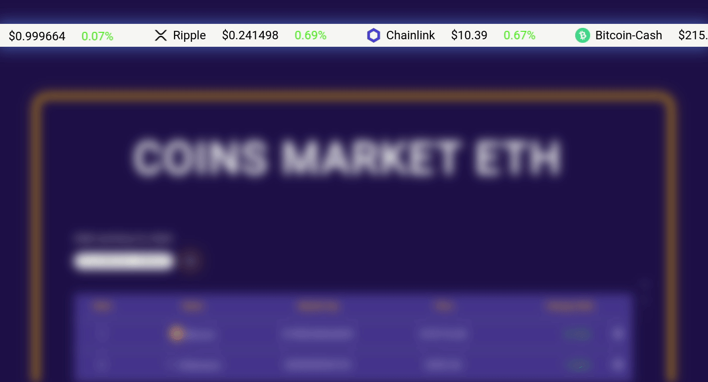
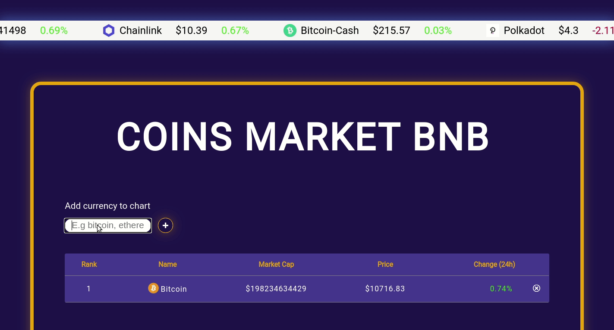

This project was bootstrapped with [Create React App](https://github.com/facebook/create-react-app).

# Coin Info App
###### View trending currency
 

###### Add coins of your interest, you can remove coins from the chart !
 

###### Find current news on your favorite currencies and other topics !
 

#### Getting Started
* Clone this project
* Go to the project folder `cd recipe-app`
* Install dependencies `npm install`
* Run in local environment `npm start`

#### Deployment / Compilation
###### To deploy to production, run the command `npm run build`
